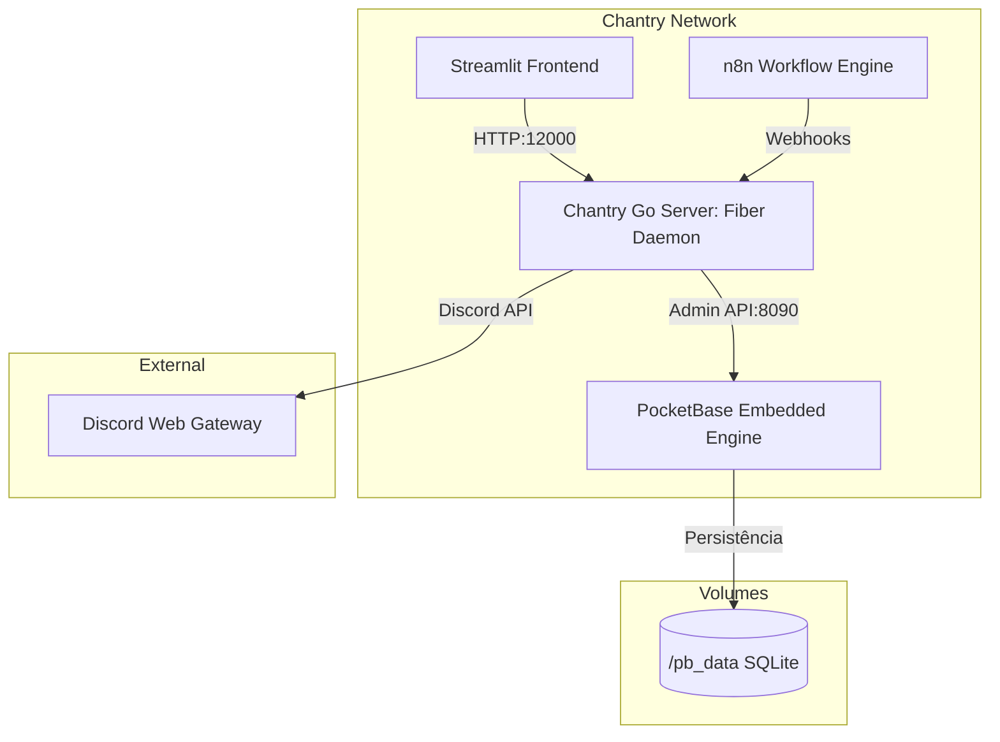

# 🌌 Relatório de Engenharia e Status: Suíte Chantry (18/05/2026)

Este documento sumariza as evoluções arquiteturais, modelagem de dados e a integração entre o daemon em Go e a persistência no PocketBase realizadas na data de hoje. 

---

## 🏛️ Visão Geral da Nova Arquitetura Híbrida

Hoje realizamos uma das evoluções mais significativas do ecossistema Chantry: a consolidação de uma **arquitetura de imagem única** e a transição para um **PocketBase embarcado (embedded)** dentro da nossa aplicação Go. 

O binário `./main` gerado agora atua em duas frentes independentes com base nos argumentos de execução:
1. **PocketBase Server (`./main serve`)**: Executa o banco de dados local embarcado, aplica migrações de esquema e expõe as portas de dados.
2. **Discord Go Daemon (`./main api`)**: O nosso servidor original baseado em Fiber que faz a ponte com a API do Discord e orquestra regras de negócio do backend.



---

## 💾 Épico 2.1: Modelagem de Dados no PocketBase

A persistência do banco de dados local foi modernizada com alta normalização de dados para evitar *anti-patterns* de coleções embutidas, estruturando chaves estrangeiras e regras estritas de segurança.

### Coleções Estruturadas
O esquema foi estruturado no arquivo local [pb_schema.json](file:///Users/caiosoares/_Nexus/sirius/Projects/Chantry/pb_schema.json) contemplando:
*   **`guilds`**: Monitoramento dos servidores (Discord ID e Status de ativação).
*   **`roles`**: Cargos de turmas vinculados a um servidor específico.
*   **`students`**: Snapshot de alunos sincronizados do Discord, associando-os com `roles`, `guilds`, status escolar e de canais dedicados.
*   **`managers`**: Equipe de mentores e administradores associados a múltiplos servidores.
*   **`attendances`**: Presenças individuais contendo timestamps, notas de justificativa, status (presente/falta/justificado) e fonte do registro (bot/manual).
*   **`activities`**: Atividades e tarefas propostas em cada guilda escolar.

### Regras de Segurança Aplicadas
*   **Todas as `*Rules` (list, view, create, etc.) foram trancadas com `""`**: Isso impossibilita requisições diretas não autenticadas vindas da API pública (como browsers e fontes externas), isolando o banco. Apenas conexões contendo cabeçalhos válidos de **Admin JWT** (ou nosso backend) conseguem ler e escrever nas coleções.
*   **Unique Indexes**: Configuração de índices de unicidade nos campos `discord_id` para garantir integridade física no SQLite subjacente.

---

## ⚡ Épico 2.2: Camada de Integração Go ↔ PocketBase (REST)

Para orquestrar a comunicação do Fiber com o PocketBase, desenvolvemos a camada de persistência nativa em Go sem dependências pesadas, utilizando apenas a biblioteca padrão (`net/http` e `encoding/json`).

### Componentes Desenvolvidos

#### 1. Configurações Dinâmicas e Injeção
*   Estendemos a struct `Config` em [env.go](file:///Users/caiosoares/_Nexus/sirius/Projects/Chantry/backend/internal/config/env.go) para suportar `PocketBaseURL`, `PBAdminEmail` e `PBAdminPassword`.
*   Ajustamos o [docker-compose.yml](file:///Users/caiosoares/_Nexus/sirius/Projects/Chantry/docker-compose.yml) para injetar as credenciais administrativas do PocketBase no container do `go-server`, evitando falhas de autenticação em ambiente isolado.

#### 2. Models Go
*   Criamos o pacote [models.go](file:///Users/caiosoares/_Nexus/sirius/Projects/Chantry/backend/internal/pocketbase/models.go).
*   **Ponto Crítico**: As structs `StudentRecord` e `ManagerRecord` contêm o campo `UserID` (`user_id` em JSON) para mapear o vínculo programático à tabela nativa de `users` que é injetado durante a migração automática do PocketBase embarcado.

#### 3. REST Client Thread-Safe
*   Em [client.go](file:///Users/caiosoares/_Nexus/sirius/Projects/Chantry/backend/internal/pocketbase/client.go), implementamos um cliente REST que manipula concorrentemente o token JWT obtido no endpoint de login (`/api/admins/auth-with-password`). O acesso e renovação do token são protegidos por um `sync.RWMutex`.
*   O método utilitário `SendRequest` anexa automaticamente os cabeçalhos de content-type e `Authorization: Bearer <TOKEN>`.

#### 4. Repositório Abstrato
*   O arquivo [repository.go](file:///Users/caiosoares/_Nexus/sirius/Projects/Chantry/backend/internal/pocketbase/repository.go) encapsula as rotas do PocketBase:
    *   `FindFirstByDiscordID`: Utiliza buscas com filtros nativos (`filter=discord_id='...'`), escapa caracteres de query e desempacota o primeiro elemento do array da resposta padrão do PocketBase (`ListResponse`).
    *   `CreateRecord`: Cria registros via POST retornando o id interno persistido.
    *   `UpdateRecord`: Atualiza parcialmente dados via PATCH.

#### 5. Bootstrap & Evitação de Conflitos
*   No ponto de entrada do servidor em [main.go](file:///Users/caiosoares/_Nexus/sirius/Projects/Chantry/backend/cmd/api/main.go), usamos um alias de import (`pbclient`) para o nosso pacote de persistência, evitando qualquer conflito de escopo com o SDK embarcado oficial do PocketBase.
*   O servidor Fiber valida as credenciais na inicialização da aplicação (`runFiberApp`). Se o PocketBase local estiver desligado ou credenciais incorretas forem passadas no `.env`, o servidor realiza um encerramento precoce (`log.Fatalf`), garantindo a segurança do ecossistema.

---

## 🚀 Status da Compilação e Deploy Local

Realizamos o teste integrado de compilação e deploy do ecossistema completo usando os containers Docker do compose. O resultado foi **100% de sucesso**:

```bash
$ docker-compose -f 'docker-compose.yml' up -d --build
```

**Logs de Builds e Inicialização:**
*   Compilação otimizada do Go (`CGO_ENABLED=0 GOOS=linux go build`) executada com sucesso.
*   Geração das imagens CACHED do Streamlit (Python dependency stage) economizando recursos.
*   **Deploy Completo dos Containers:**
    *   `chantry_n8n` -> Rodando perfeitamente.
    *   `chantry_pocketbase` -> Inicializado (Migrações Go executadas e Admin provido).
    *   `chantry_go_server` -> Inicializado (Autenticado com sucesso no PocketBase).
    *   `chantry_streamlit` -> Inicializado e acessível.

---

## 📋 Próximos Passos
1.  **Desenvolvimento de Casos de Uso (Usecases)**: Começar a estruturar os fluxos do Go que puxam dados de membros das guildas do Discord e os registram de forma sincronizada no repositório do PocketBase.
2.  **Dashboard no Streamlit**: Iniciar o consumo do `go-server` para listar os status dos alunos, sincronizações pendentes e visualização da matriz de presença.
