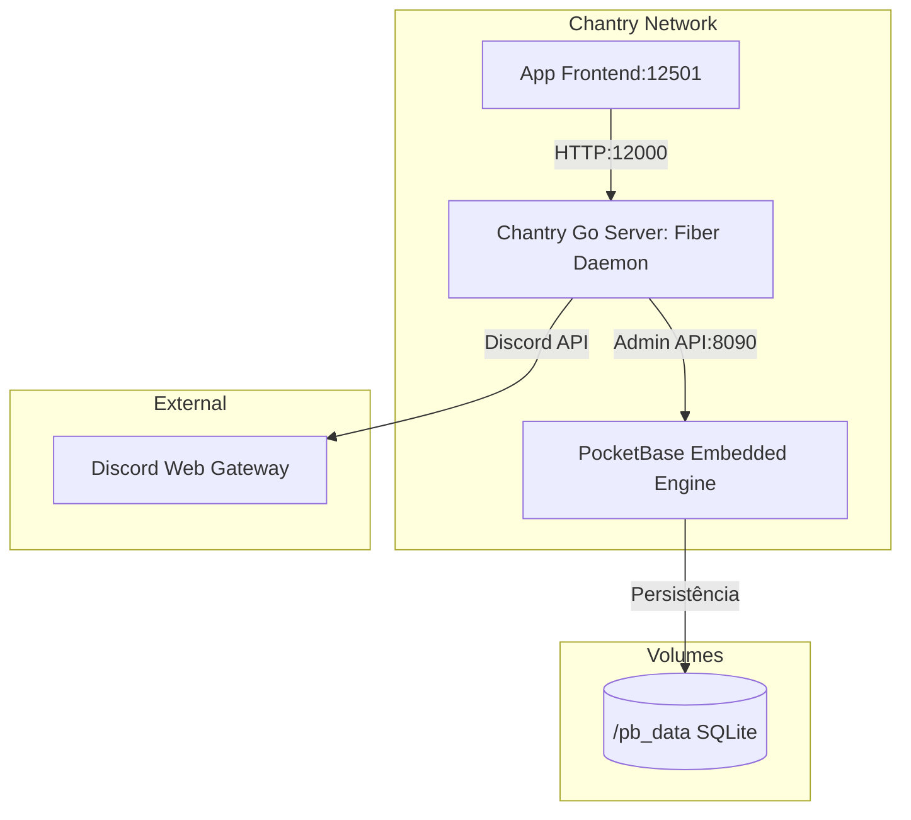

# 🌌 Relatório de Engenharia e Status: Suíte Chantry (18/05/2026)

Este documento sumariza as evoluções arquiteturais, modelagem de dados, motor de provisionamento, painel de controle e mecanismos de disaster recovery realizados no ecossistema Chantry.

---

## 🏛️ Visão Geral da Arquitetura Híbrida

Hoje realizamos a consolidação de uma **arquitetura de imagem única** no server, a transição para um **PocketBase embarcado (embedded)** em Go, a implementação do **Motor de Provisionamento em Lote de Canais Privados**, o **Motor Cron de Agendamento Dinâmico** e a **remoção completa do n8n da stack**, simplificando a infraestrutura da aplicação.

O binário `./main` em Go atua em duas frentes independentes com base nos argumentos de execução:
1. **PocketBase Server (`./main serve`)**: Executa o banco de dados SQLite local embarcado, aplica migrações automáticas de esquema e expõe as portas de dados HTTP na porta `12090` (ou `8090` interno).
2. **Discord Go Daemon (`./main api`)**: Servidor API em Fiber que gerencia integrações com Discord API, orquestra regras de negócio do server e atualizações no banco de dados na porta `12000`.

---

## 💾 Épico 2.1: Modelagem de Dados no PocketBase

A persistência do banco de dados local foi modernizada com alta normalização de dados para evitar *anti-patterns* de coleções embutidas, estruturando chaves estrangeiras e regras estritas de segurança.

### Coleções Estruturadas
O esquema foi estruturado no arquivo local [pb_schema.json](file:///Users/caiosoares/_Nexus/sirius/Projects/Chantry/server/internal/migrations/pb_schema.json) contemplando:
*   **`guilds`**: Monitoramento dos servidores (Discord ID e Status de ativação).
*   **`roles`**: Cargos de turmas vinculados a um servidor específico.
*   **`students`**: Snapshot de alunos sincronizados do Discord, associando-os com `roles`, `guilds`, status escolar e de canais dedicados.
*   **`managers`**: Equipe de mentores e administradores associados a múltiplos servidores.
*   **`attendances`**: Presenças individuais contendo timestamps, notas de justificativa, status (presente/falta/justificado) e fonte do registro.
*   **`activities`**: Atividades e tarefas propostas em cada guilda escolar.

### Regras de Segurança Aplicadas
*   **Todas as `*Rules` (list, view, create, etc.) foram trancadas com `""`**: Isso impossibilita requisições diretas não autenticadas vindas da API pública (como browsers e fontes externas), isolando o banco. Apenas conexões contendo cabeçalhos válidos de **Admin JWT** (ou nosso server) conseguem ler e escrever nas coleções.
*   **Unique Indexes**: Configuração de índices de unicidade nos campos `discord_id` para garantir integridade física no SQLite subjacente.

---

## ⚡ Épico 2.2: Camada de Integração Go ↔ PocketBase (REST)

Para orquestrar a comunicação do Fiber com o PocketBase, desenvolvemos a camada de persistência nativa em Go sem dependências pesadas, utilizando apenas a biblioteca padrão (`net/http` e `encoding/json`).

### Componentes Desenvolvidos
*   **Configurações Dinâmicas:** Estendemos a struct `Config` em [env.go](file:///Users/caiosoares/_Nexus/sirius/Projects/Chantry/server/internal/config/env.go) para suportar as credenciais e URL do PocketBase.
*   **Models Go:** No pacote [models.go](file:///Users/caiosoares/_Nexus/sirius/Projects/Chantry/server/internal/pocketbase/models.go), estruturamos as structs de dados necessárias.
*   **REST Client Thread-Safe:** Em [client.go](file:///Users/caiosoares/_Nexus/sirius/Projects/Chantry/server/internal/pocketbase/client.go), implementamos o cliente REST que gerencia de forma segura o JWT de administrador, com auto-anexação de headers nas requisições.
*   **Repositório Abstrato:** O repositório [repository.go](file:///Users/caiosoares/_Nexus/sirius/Projects/Chantry/server/internal/pocketbase/repository.go) encapsula as operações do banco: `FindFirstByDiscordID`, `CreateRecord`, `UpdateRecord`, `FindFirstByDiscordAndGuild` e `FindManagersByGuild`.

---

## ✨ Épico 3: Motor de Infraestrutura e Provisionamento em Lote

Concluímos o desenvolvimento completo dos fluxos de provisionamento automático de canais de texto privados (1-on-1) para as turmas, blindando o servidor do Discord contra rate limits e integrando as operações com o banco de dados.

### 🏢 PRD 3.1 - Gerenciamento de Categorias (Parent Scope)
*   **Listagem de Categorias:** Implementamos o endpoint `GET /api/discord/guilds/:guildId/categories` que retorna todas as categorias do servidor para seleção reativa.
*   **Criação de Categorias:** Implementamos o endpoint `POST /api/discord/guilds/:guildId/categories` que cria instantaneamente uma nova categoria de canais personalizada no Discord e retorna os dados do canal criado (incluindo o ID gerado e posição).

### 🔒 PRD 3.2 - Core de Permissões e Canais Privados (1-on-1 Factory)
*   **Algoritmo de Blindagem Bitwise:** Desenvolvemos a factory especialista `CreatePrivateChannel` no serviço do Discord:
    *   **Bloqueio Total do `@everyone`:** Remove a permissão de visualização (`PermissionViewChannel`) de todos os usuários do servidor de forma nativa (onde o ID do cargo `@everyone` é estritamente igual ao ID do Servidor).
    *   **Permissão do Aluno Dono:** Concede permissão explícita de visualização e envio de mensagens para o ID do Aluno.
    *   **Permissão dos Managers:** Permite que a equipe de mentores/administradores (carregados via banco na relação da guilda) visualizem e moderem o canal.

### ⚙️ PRD 3.3 - Motor de Processamento em Lote e Worker Sincronizador
*   **Resolução Inteligente de IDs:** O Usecase [provision_usecase.go](file:///Users/caiosoares/_Nexus/sirius/Projects/Chantry/server/internal/usecases/provision_usecase.go) recebe os IDs Discord Snowflake de Guilda e Cargo e os resolve para os correspondentes IDs relacionais de 15 caracteres do PocketBase para que as queries funcionem perfeitamente.
*   **Motor de Cooldown (Pulmão):** Adiciona uma pausa nativa de `800ms` (`time.Sleep`) em cada iteração, protegendo a conta do Bot de bloqueios da API REST do Discord.
*   **Garantia de Idempotência:** Busca no PocketBase utilizando a query `FindStudentsPendingProvision` que busca exclusivamente alunos cujo campo `channel_id` esteja vazio e inclui `limit=200` para processamento completo em lote. Alunos com canal ativo são ignorados.
*   **Transacionalidade e Durabilidade:** Salva o `channel_id` individualmente no PocketBase logo após a criação no Discord, prevenindo perda de estado em caso de queda de rede ou reinicialização.
*   **Roteamento Fiber:** Endpoint mapeado em `POST /api/provision/guilds/:guildId/channels`.

---

## ⏰ Épico 4: Schema Híbrido, Agendamento e Disaster Recovery

Expandimos o motor para gerenciar rotinas inteligentes de horários e resolver incidentes de perda de banco de dados sem quebrar a infraestrutura física já instalada no Discord.

### 📊 PRD 4.1 & 4.3.a - Evolução do Schema de Horários & Flags de Ativação
*   **Novas Colunas em `roles`**: Evoluímos a tabela de cargos para carregar suas próprias regras operacionais de presença. O arquivo `pb_schema.json` agora contempla:
    *   `shift` (Turno selecionado: Manhã/Tarde/Noite).
    *   `check_in_time` (Horário de disparo da mensagem de bom dia).
    *   `checkout_cooldown` (Janela/tolerância de saída em horas).
    *   `is_monitored` (Diferencia visual e logicamente squads/turmas ativas de cargos de acesso comuns no Discord).
    *   `is_active` (Permite que o administrador ative ou pause temporariamente os envios automáticos sem perder os horários).
*   **Painel Administrativo (`4_schedule_config.py`)**: Dividido em abas funcionais:
    1.  *⏰ Horários de Ponto*: Edição direta dos parâmetros e ativação/pausa dinâmica via toggles em cards interativos.
    2.  *⚙️ Triagem de Turmas*: Permite associar cargos gerais a turmas de forma seletiva, disparando requisições `PATCH` apenas para registros que de fato sofreram alteração, garantindo performance e integridade de estado.

### 🛠️ PRD 4.3.b - Auto-Healing / Disaster Recovery
Caso a base de dados do PocketBase seja deletada ou resetada, o Chantry consegue restaurar de forma imediata o ecossistema reimportando os alunos e aplicando nosso algoritmo exclusivo de recuperação de canais órfãos.
*   **Algoritmo de Correlação Bidirecional**:
    1.  **Mecanismo por Discord ID (Estratégia Primária - Ultra-Precisa)**: O motor de auto-healing escaneará cada canal sob a categoria selecionada. Ele analisa os `PermissionOverwrites` buscando por uma permissão de membro cujo ID corresponda a um aluno cadastrado no PocketBase. Por utilizar o ID Snowflake único do Discord (que nunca muda), esta estratégia é totalmente imune a trocas de nicknames e usernames dos alunos.
    2.  **Fallback por Username (Estratégia Secundária)**: Caso as permissões tenham sido alteradas, o algoritmo extrai o username do padrão de nomenclatura do canal (`1-on-1-<username>`) e tenta associá-lo ao aluno correspondente.
*   **Interface no App (`3_infra_provisioning.py`)**: Inclui uma zona segura com `st.expander` onde o administrador escolhe a categoria com os canais órfãos e dispara a recuperação transacional do banco em segundos, exibindo os resultados consolidados das métricas de cura.

### ⏰ PRD 4.4 - Motor de Saída (Clock-out Timer)
Desenvolvemos uma rotina assíncrona desacoplada em Go (`StartClockOutTicker`) que varre o banco a cada 1 minuto localizando registros com status `pending_checkout`. Se o intervalo desde a hora de entrada (`clock_in`) acrescido do cooldown configurado ultrapassar o horário atual, um botão vermelho interativo (`btn_clock_out`) é despachado no canal privado do respectivo aluno e a flag `checkout_prompt_sent` é atualizada para evitar spam.

### 📊 PRD 4.5 - Frontend: Dashboard de Ponto (Visão Gerencial)
A interface administrativa possui agora um painel gerencial consolidado (`5_attendance_dashboard.py`).
*   **Agregador no Server**: Nova rota `GET /api/reports/guilds/:guildId/attendances` que extrai as presenças diárias, mapeia nicknames e usernames de forma eficiente e expõe um payload DTO unificado.
*   **Layout App**: Tela com visualização premium (Outfit font, glassmorphism), indicadores dinâmicos em cards de métricas (Presenças completas, em andamento, atrasados e faltas) e tabela Pandas contendo emojis descritivos estruturada de forma responsiva.

---

## 📢 Épico 6: Motor de Comunicação (Broadcast Center)

Implementamos a **Central de Mensagens Avançada** (Megafone), permitindo que administradores realizem disparos em lote no servidor do Discord de forma imediata ou agendada, integrados de forma assíncrona ao banco local.

### 🎯 PRD 6.1 & 6.2 - Modelagem de Disparo e Validação de Tipos (Targeted Broadcast)
*   **Abordagem Livre de Efeitos Colaterais:** O server suporta duas direções principais de envio:
    *   `public` (Aviso Geral): Busca o `announcement_channel_id` configurado na guilda e envia uma única mensagem formatada.
    *   `private` (Mensagem Direta 1-on-1): Busca os canais 1-on-1 ativos correspondentes aos filtros e realiza o envio seguro de mensagens em lote, com pausa preventiva anti-spam de `500ms`.
*   **Migração de Schema e Resolução de Erros 404:** Descobrimos que a coleção `broadcasts` no PocketBase precisava ser criada e registrada internamente para estar exposta na REST API. Corrigimos isso de forma transacional:
    1.  Redefinimos `target_type` para `text` e `target_roles` para `json` em `pb_schema.json` para evitar que o validador select do PocketBase salvasse valores nulos de forma silenciosa.
    2.  Criamos a **Migration 2** (`2_fix_broadcasts_schema.go`) para limpar qualquer tabela SQL crua conflitante.
    3.  Criamos a **Migration 3** (`3_reimport_schema.go`) para forçar o re-import do schema JSON, registrando oficialmente a coleção no PocketBase e resolvendo erros de 404 da REST API.

### ⚙️ PRD 6.3 - Worker Assíncrono e Correção do `UpdateRecord`
*   **Fire-and-Forget Seguro:** Corrigimos o método `UpdateRecord` no pacote `repository.go` do Go. Anteriormente, o Worker assíncrono passava o ponteiro `dest` como `nil` para atualizações de status silenciosas, o que disparava um panic de *json.Unmarshal(nil)* ao tentar desserializar a resposta HTTP. Agora, o repositório valida se `dest != nil` antes de invocar o decoder, assegurando a estabilidade das atualizações assíncronas de estado (`scheduled` -> `processing` -> `completed`/`failed`).

### 🎨 PRD 6.4 - Reatividade de Interface Premium no App (`6_broadcast_center.py`)
*   **Reatividade Resolvida:** Os componentes reativos (Seletor de Destino, Multiselect de Cargos Alvo, Tipo de Envio e inputs de Data/Hora de agendamento) foram extraídos para **fora** do `st.form` do App. Isso permite que a página re-renderize os inputs instantaneamente ao interagir, garantindo que:
    *   O seletor de cargos alvos seja condicionalmente exibido apenas sob a opção de DM filtrada.
    *   Os seletores de data/hora fiquem cinzas e desabilitados (`disabled=True`) quando a opção "Enviar Agora" estiver selecionada.
*   **Envio via Session State:** O form cuida estritamente do conteúdo da mensagem e do submit, lendo dinamicamente os valores de agendamento gravados no `st.session_state` no instante do clique, garantindo um fluxo limpo sem perder o estado reativo.

---

## 🌌 Épico R: Página Zero (Health Dashboard & Onboarding Wizard)

Implementamos a **Página Zero** (Wizard de Onboarding e Dashboard de Saúde) atuando como uma Torre de Controle central e auxiliando administradores na inicialização e diagnóstico do ecossistema.

### 🩺 BFF de Saúde (`GET /api/system/health`)
*   Criamos uma rota unificada e rápida `/api/system/health` no Go Daemon. O endpoint consulta o WebSocket do Discord para confirmar se a conexão está ativa (`connected` ou `disconnected`), realiza a contagem total de registros das coleções `guilds`, `students` e `attendances` no PocketBase para atestar sua integridade (`healthy` ou `unhealthy`), e expõe o Client/App ID configurado na variável `DISCORD_APP_ID`.

### 🧭 Painel Central & Wizard no App (`app.py`)
*   Refatoramos completamente o arquivo raiz do Streamlit para se comunicar dinamicamente com a rota de saúde.
*   **Resiliência a Quedas:** Caso o Go Daemon esteja fora do ar, o Streamlit intercepta graciosamente o erro de rede, exibindo uma tela vermelha limpa explicando o problema e interrompendo a renderização (`st.stop()`).
*   **Visualização Premium de Status:** Exibição elegante em 3 cards no estilo glassmorphism mostrando a integridade do Go Daemon, do PocketBase e da conexão WebSocket do bot.
*   **Métricas Ativas:** Exibição em blocos `st.metric` do total de servidores monitorados, alunos cadastrados e presenças computadas.
*   **Linkador OAuth2 Dinâmico:** Um wizard de 3 passos explicando a inicialização correta da plataforma e fornecendo o botão mágico `Convidar Bot para o Discord`, montando a URL dinamicamente via `st.link_button` usando as permissões completas de administrador (`permissions=8`) e escopos necessários (`bot+applications.commands`).

---

---

## ⚙️ Épico R.2: A "Super Tela" de Setup do Servidor (Consolidação e Fail-Safes)

Implementamos a consolidação das páginas de configuração inicial em uma única e poderosa tela unificada: `2_server_setup.py`.

### 🧹 Limpeza de Arquivos Legados
Ficheiros independentes excluídos da pasta `app/pages/`:
- `2_discord_sync.py`
- `3_infra_provisioning.py`
- `4_schedule_config.py`
- `8_squad_management.py`

### 🏗️ Lógica de Configuração em Abas e Proteções (Fail-Safes)
Toda a configuração está contida no arquivo unificado `2_server_setup.py`:
1. **Seletor de Contexto Global**: O ID da guilda (`guild_id`) é selecionado na região principal da página no topo e compartilhado via `st.session_state` entre as abas.
2. **Aba 1 (🔄 Sincronização)**: Sincronização de cargos primários, secundários e equipe/managers.
3. **Aba 2 (👥 Estrutura e Squads)**: Configuração de canais oficiais por turma, métricas rápidas e roster de alunos cadastrados.
4. **Aba 3 (⏰ Regras de Ponto)**: Triagem de cargos monitorados, horários de check-in/cooldown e Sandbox Tester (Dry Run).
5. **Aba 4 (🏗️ Infraestrutura)**: Canal de avisos geral, gerenciamento de categorias do Discord, provisionamento de salas privadas 1-on-1 e Auto-Healing.
6. **Mecanismos de Bloqueio**:
   - Caso a guilda possua 0 alunos registrados na base, as abas 2, 3 e 4 exibem `st.warning("⚠️ Sincronize o servidor primeiro.")` e impedem interações.
   - Caso a triagem na Aba 3 não possua cargos monitorados, o botão de provisionamento de canais na Aba 4 é desativado.

---

## 🚀 Status da Compilação e Validações

Realizamos os testes de compilação estática em ambas as linguagens e a integridade de todas as entregas foi validada com **100% de sucesso**:

1.  **Server Go Daemon (`go build`):**
    *   **Comando:** `go build -o /dev/null ./cmd/api/main.go` (no diretório `server`)
    *   **Resultado:** Compilação bem-sucedida, sem erros de tipagem estática ou injeção (`Exit code: 0`).
2.  **Frontend App (`python3 -m py_compile`):**
    *   **Comando:** `python3 -m py_compile app/pages/2_server_setup.py`
    *   **Resultado:** Sintaxe Python e importações validadas sem erros (`Exit code: 0`).

