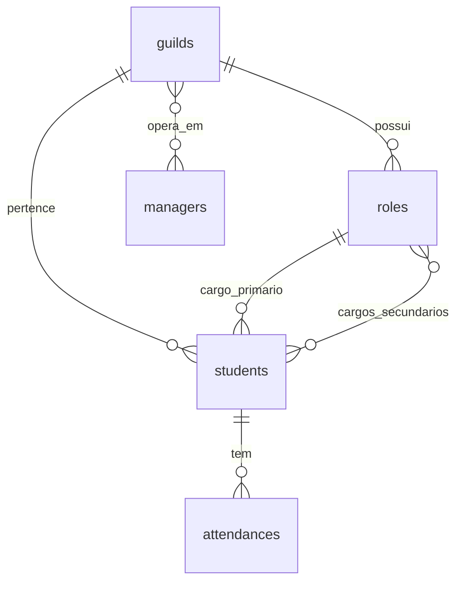

# Relatório de Estrutura de Banco e Migrações (PocketBase) - 18/05/2026

Este relatório documenta a arquitetura, o estado atual das coleções, restrições de chaves e o fluxo de inicialização e migrações do banco de dados relacional PocketBase embarcado no **Chantry Suite v0.1.0**.

---

## 🏗️ Arquitetura de Migração Automática

O **Chantry Go Daemon** embarca o PocketBase como um banco de dados relacional nativo rápido de alto desempenho (SQLite interno). As coleções e esquemas de tabelas são declarativos e sofrem evolução baseados no arquivo:
- 📄 [pb_schema.json](file:///Users/caiosoares/_Nexus/sirius/Projects/Chantry/backend/internal/migrations/pb_schema.json)

### Fluxo de Inicialização (`init.go`)
No boot do container `go-server` / `pocketbase`, o arquivo de migrations [init.go](file:///Users/caiosoares/_Nexus/sirius/Projects/Chantry/backend/internal/migrations/init.go) executa a importação declarativa transacional:
1. **Embedding estático**: O arquivo `pb_schema.json` é compilado dentro do binário final em Go usando o compilador nativo (`//go:embed pb_schema.json`).
2. **Preservação de Integridade**: A coleção nativa de autenticação de usuários (`users`) é consultada no banco SQLite físico em `/pb_data/data.db` e mesclada na fila de importação para garantir que credenciais de login administrativas ou do painel não sejam sobrescritas.
3. **Injeção de Chaves Estrangeiras**: O código injeta programaticamente a relação `user_id` em `students` e `managers` apontando para a tabela `users`.
4. **Importação Declarativa**: O método `dao.ImportCollections(collections, true, nil)` é invocado com `deleteMissing = true`. Isso garante que coleções excluídas, novos campos ou restrições de chaves exclusivas alteradas (como a remoção de índices únicos antigos) sejam aplicados e sincronizados de forma atômica no SQLite físico.

---

## 📊 Estrutura Atual das Coleções

Atualmente, o banco de dados é composto por 5 coleções principais, detalhadas abaixo:

### 1. Coleção `guilds` (Servidores Discord / Projetos)
Representa os diferentes servidores do Discord autorizados e sincronizados na plataforma.
- **Campos**:
  - `discord_id` (Text, obrigatório): Snowflake ID único do servidor no Discord.
  - `name` (Text, obrigatório): Nome amigável do servidor.
  - `status` (Select: `active`, `inactive`): Controle de status de ativação do projeto.
- **Restrição**: Índice exclusivo em `discord_id`.

### 2. Coleção `roles` (Cargos do Servidor)
Armazena a listagem de cargos de turmas, equipes ou trilhas de skills sincronizados para mapeamento.
- **Campos**:
  - `discord_id` (Text, obrigatório): Snowflake ID único do cargo.
  - `name` (Text, obrigatório): Nome do cargo.
  - `guild_id` (Relation, obrigatório, `maxSelect: 1`): Chave estrangeira que vincula o cargo à sua guilda no PocketBase (ID interno de 15 caracteres).
- **Restrição**: Índice exclusivo em `discord_id`.

### 3. Coleção `students` (Alunos / Turmas)
Coleção que rastreia os alunos matriculados nos respectivos projetos educacionais. Sofreu importante evolução para suportar regras multi-guildas e multicargos.
- **Campos**:
  - `discord_id` (Text, obrigatório): Snowflake ID do usuário no Discord.
  - `username` (Text, obrigatório): Nome de usuário Discord (ex: `joaozinho`).
  - `nickname` (Text, opcional): Apelido local do estudante no servidor.
  - `role_id` (Relation, `maxSelect: 1`): Cargo primário de turma/squad (vínculo com `roles`).
  - `secondary_roles` (Relation, `maxSelect: null`): Cargos secundários acumulados de trilhas/skills (vínculo múltiplo com `roles`).
  - `guild_id` (Relation, `maxSelect: 1`): Projeto/Guilda correspondente (vínculo com `guilds`).
  - `channel_id` (Text, opcional): ID do canal de texto reservado do estudante.
  - `status` (Select: `active`, `inactive`, `dropped`): Estado atual da matrícula.
  - `user_id` (Relation, `maxSelect: 1`): Vínculo com a conta de usuário administrativa do sistema.
- **💡 Evolução de Restrições (PRD 2.6)**: 
  - Removido o antigo índice simples exclusivo em `discord_id`.
  - Criado o **Índice Composto Único** nas colunas `(discord_id, guild_id)` via:
    `"CREATE UNIQUE INDEX idx_students_discord_guild ON students (discord_id, guild_id)"`
  - *Impacto*: O mesmo aluno (`discord_id`) pode coexistir de forma isolada em dezenas de projetos (guildas) simultaneamente, mantendo turmas e apelidos independentes.

### 5. Coleção `managers` (Equipe / Mentores / Pedagogia)
Representa os líderes, facilitadores e membros de suporte que gerenciam os alunos.
- **Campos**:
  - `discord_id` (Text, obrigatório): Snowflake ID do usuário Discord.
  - `name` (Text, obrigatório): Nome de exibição ou apelido.
  - `role` (Select: `admin`, `mentor`, `pedagogy`): Nível de acesso na suite escolar.
  - `guilds` (Relation, `maxSelect: null`): Mapeamento múltiplo relacionando as guildas nas quais o manager está autorizado a operar.
  - `user_id` (Relation, `maxSelect: 1`): Vínculo com a conta de login administrativo.
- **Restrição**: Índice exclusivo global simples em `discord_id` (`idx_managers_discord_id`).
  - *Impacto*: Em total alinhamento com a diretriz do projeto, um manager possui um único registro global centralizado, agregando múltiplos projetos na coluna relacional múltipla `guilds`.

### 5. Coleção `attendances` (Matriz de Presença)
Coleção de lançamentos transacionais que audita a frequência de estudantes nas aulas.
- **Campos**:
  - `student_id` (Relation, obrigatório, `maxSelect: 1`): Vínculo com o estudante da aula (ID de 15 caracteres).
  - `date` (Date, obrigatório): Data da aula lançada.
  - `status` (Select: `present`, `absent`, `justified`, `late`): Frequência do estudante.
  - `source` (Select: `discord_bot`, `manual_override`): Origem da chamada.
  - `notes` (Text, opcional): Observações e justificativas de ausências.

---

## 📈 Resumo da Evolução das Migrações (18/05/2026)

| PRD | Alteração no Banco | Motivação | Impacto no Go Server / Usecase |
| :--- | :--- | :--- | :--- |
| **PRD 2.3** | Criação das tabelas de integridade `guilds` e `roles`. | Sincronização inicial simples de alunos de Discord para PocketBase. | `FindFirstByDiscordID` resolve e upserta guildas/cargos de forma oculta. |
| **PRD 2.5** | Adição do campo `secondary_roles` em `students` (multi-relation). | Suporte para mapeamento de skills secundárias dos estudantes (trilhas). | O Upsert resolve o cruzamento dinâmico dos IDs relacionais no Discord. |
| **PRD 2.6** | Refatoração de Unicidade em `students` de `discord_id` simples para composto `(discord_id, guild_id)`. | Suporte multi-tenant: permitir o mesmo estudante em múltiplos projetos/guildas. | Adicionado método `FindFirstByDiscordAndGuild` no repositório Go para isolamento transacional por guilda. |

---

## 🔧 Diagnóstico de Sanidade do Banco de Dados

Em testes locais conduzidos em containers Docker, a stack iniciou de forma limpa:
- **Migration Engine**: Importou 100% dos coletores e gerou os novos índices de chave composta exclusiva sem erros.
- **Go Connection**: O cliente Go do servidor Fiber autenticou como admin no SQLite perfeitamente e está escutando na porta `12000`, confirmando que as requisições HTTP REST do repositório contra as rotas de schema do PocketBase estão íntegras e saudáveis.
